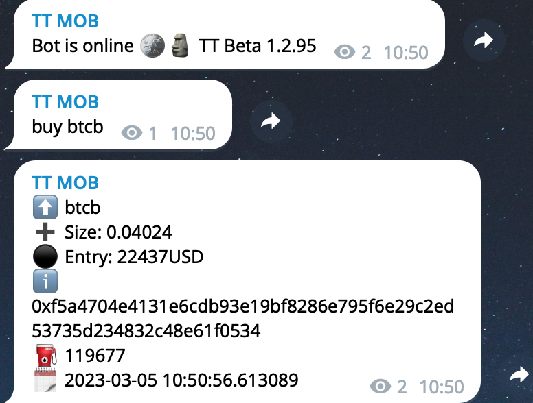

.. _talky_index:

===========
TalkyTrader
===========

| Connect CEX and DEX exchanges across multi messaging platforms.
| Place order, inquire your balance and more through plugins.
| Easily deploy via Docker on self-hosted platform or Paas.

.. raw:: html

    
   

    
   

.. warning::

   This is an education tool and should not be considered professional financial investment system nor financial advice.

   Use a testnet account or USE AT YOUR OWN RISK. Never share your private keys or API secrets.

   Never use your main account for automatic trade.

   Do Your Own Research (DYOR). Past performance does not guarantee future results.

.. note::

    What is the rationale for building TalkyTrader?
    
    - Create an open source platform to allow trading on DEX and CEX on any type of messaging platform and empower trader with trading help regardless of the instrument type. Key focus on DEX capability as priority.

    - "so happy I spent $200 on trading signals" said no trader ever.

    Aren't there already projects that do this?
    
    - Project available usually focused on a given messaging platform (eg telegram), a given type of exchange (usually CeX binance),  a given type of trading (snipping DEX https://github.com/Nafidinara/bot-pancakeswap , scalping CEX or full suite trading with CEX focus ( https://github.com/Drakkar-Software/OctoBot , https://github.com/freqtrade/freqtrade https://github.com/hummingbot/hummingbot ).
    

User Guide
==========

.. toctree::
   :maxdepth: 2
   
   01_start
   02_config

Plugins Reference
================

.. toctree::
   :maxdepth: 3

   04_iamlistening
   05_findmyorder
   plugins/helper
   plugins/dex
   plugins/cex
   plugins/talkytrend
   plugins/myllm

TalkyTrader Module
==================

.. toctree::
   :maxdepth: 3

   03_module

Development Reference
=====================

.. toctree::
   :maxdepth: 3

   development/index

.. raw:: html

      
